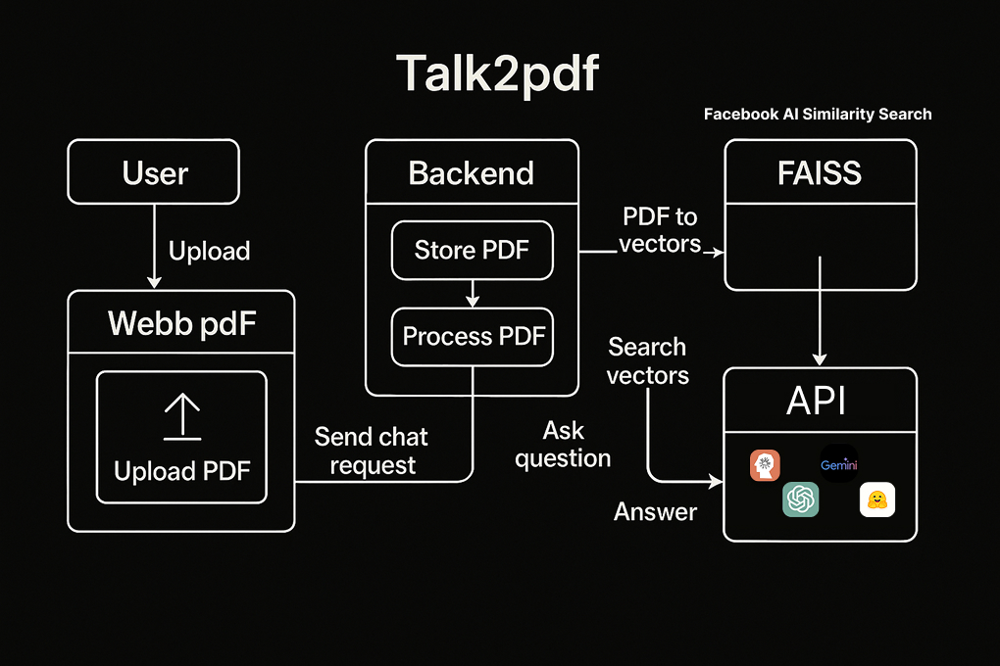
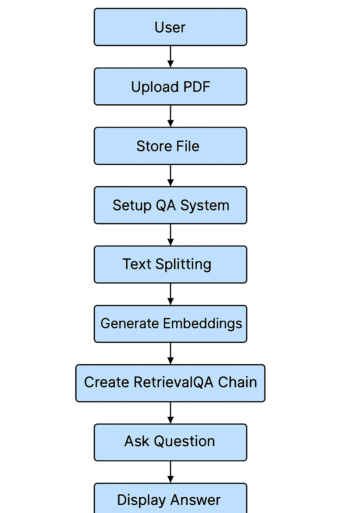

<p align="center">
  <svg width="500" height="200" viewBox="0 0 500 200" xmlns="http://www.w3.org/2000/svg">
  <defs>
    <linearGradient id="textGrad" x1="0%" y1="0%" x2="100%" y2="0%">
      <stop offset="0%" style="stop-color:#4facfe;stop-opacity:1" />
      <stop offset="100%" style="stop-color:#00f2fe;stop-opacity:1" />
    </linearGradient>
  </defs>

  <!-- PDF Icon -->
  <g transform="translate(100,50)">
    <rect width="60" height="80" rx="10" ry="10" fill="white" stroke="#ff3b30" stroke-width="4"/>
    <text x="30" y="50" font-family="Arial, sans-serif" font-size="20" fill="#ff3b30" text-anchor="middle" font-weight="bold">PDF</text>
    <!-- Chat bubble small -->
    <circle cx="60" cy="70" r="10" fill="#4facfe" />
    <circle cx="65" cy="75" r="3" fill="white" />
  </g>

  <!-- Talk2PDF Text --> 
  <text x="180" y="100" font-family="Poppins, sans-serif" font-size="40" fill="url(#textGrad)" font-weight="600">
    Talk2PDF
  </text> 

</svg>

</p>

<h1 align="center">Talk2PDF - Chat with your Documents</h1>

Talk2PDF is an intelligent web application that allows you to have interactive conversations with your PDF documents. Upload a PDF, and the app will enable you to ask questions about its content, leveraging powerful AI models to provide accurate answers from the text and even explain images within the document.

This application is built with Flask for the backend, LangChain for orchestrating the language model interactions, and Google's Gemini models for state-of-the-art text and vision understanding.

## Features

- **Interactive Chat Interface:** Ask questions in natural language and get responses in real-time.
- **PDF Content Analysis:** The system processes the entire text content of your uploaded PDF to provide comprehensive answers.
- **Image Understanding:** (Optional) Extracts images from the PDF, analyzes them, and can answer questions about their content.
- **Deduplication:** Intelligently detects and skips duplicate images within the PDF to save processing time.
- **Easy Setup:** Get the application running with just a few simple commands.
- **Secure API Key Handling:** Prompts for your API key if not found in the environment, ensuring it's not hard-coded.

## How It Works

The application follows a sophisticated workflow to process your documents and answer your questions.

### User Flow

This diagram shows the general user interaction with the application, from uploading a PDF to receiving an answer.



### Backend Processing (LangChain)

This flowchart details the step-by-step process happening on the backend, powered by LangChain, to create a question-answering system from your PDF.



1.  **Upload PDF:** The user uploads a PDF file through the web interface.
2.  **Store File:** The file is temporarily stored on the server.
3.  **Setup QA System:** The core process begins.
4.  **Text Splitting:** The document's text is broken down into smaller, manageable chunks.
5.  **Generate Embeddings:** Each text chunk is converted into a numerical representation (embedding) using Google's AI.
6.  **Create RetrievalQA Chain:** A powerful LangChain component is created, combining the language model with the document embeddings. This allows the system to retrieve relevant text chunks to answer a question.
7.  **Ask Question:** The user asks a question.
8.  **Display Answer:** The system finds the relevant information in the PDF and generates a human-like answer.

## Getting Started

Follow these instructions to set up and run the application on your local machine.

### Prerequisites

- Python 3.8 or higher
- `pip` (Python package installer)

### Installation

1.  **Clone the repository:**
    ```bash
    git clone https://github.com/nishanthnaa52/Talk2pdf
    cd Talk2pdf
    ```

2.  **Install the required packages:**
    ```bash
    pip install -r requirements.txt
    ```

### Configuration

This application requires a Google Gemini API key to function.

1.  **Get your API Key:** Visit the [Google AI Studio](https://aistudio.google.com/app/apikey) to get your free API key.

2.  **Set up the API Key:** You have two options:
    *   **Recommended:** Create a `.env` file in the root directory of the project and add your API key to it:
      ```
      GOOGLE_API_KEY="your_gemini_api_key_here"
      ```
    *   **On-the-fly:** If you run the application without a `.env` file, it will automatically prompt you to enter the API key in the terminal.

## Usage

1.  **Run the Flask application:**
    ```bash
    python app.py
    ```

2.  **Open your browser:** Navigate to `http://127.0.0.1:5000`.

3.  **Upload your PDF:**
    - Click the "Choose File" button and select a PDF document.
    - Choose the chat type:
        - **Text Only:** For asking questions about the text content.
        - **Text & Image:** For analyzing both text and images within the PDF.
    - Click "Upload".

4.  **Start Chatting:** Once the file is processed, the chat interface will appear. Type your questions and get answers instantly!

## Technologies Used

- **Backend:** Flask
- **AI Orchestration:** LangChain
- **Language & Vision Models:** Google Gemini (via `langchain-google-genai`)
- **Vector Store:** FAISS (Facebook AI Similarity Search)
- **PDF Processing:** PyMuPDF (fitz)
- **Image Processing:** Pillow, imagehash
- **Frontend:** HTML, CSS, JavaScript
